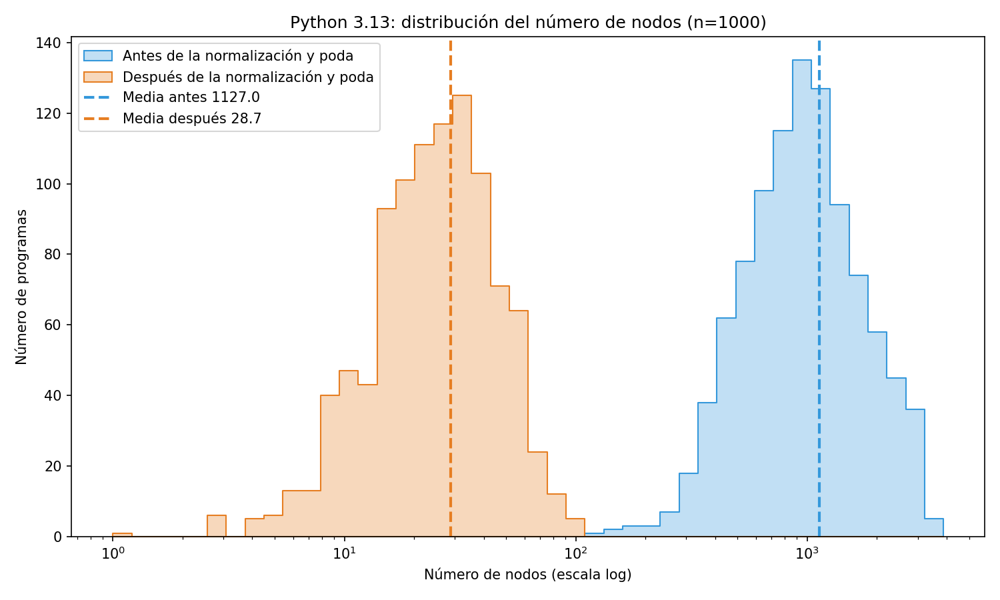
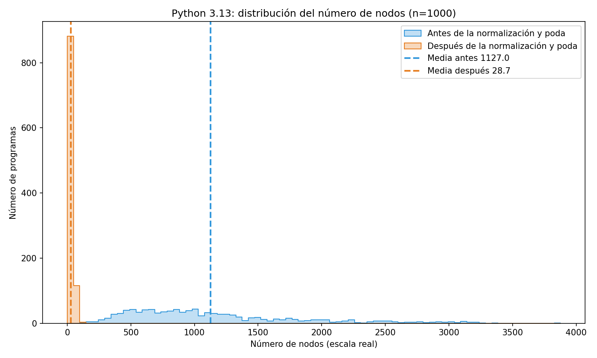
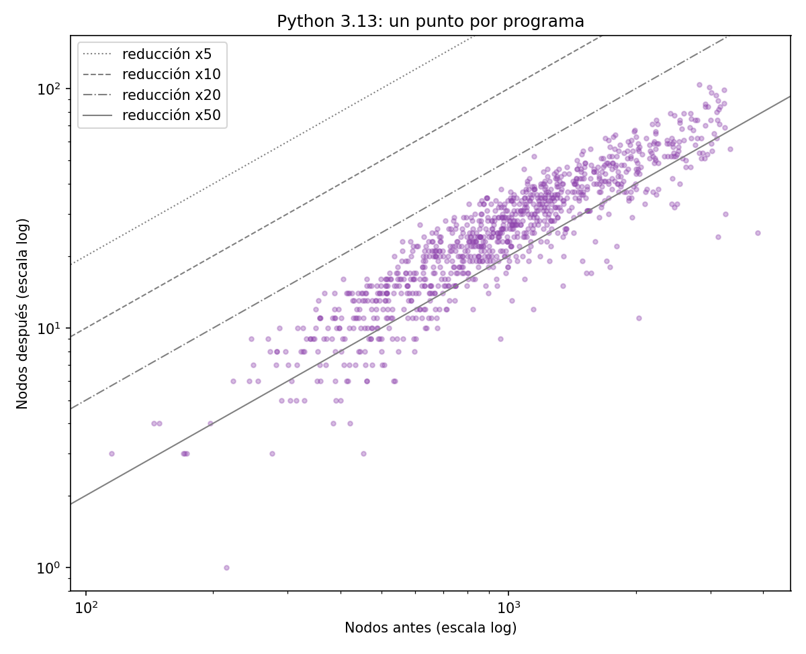
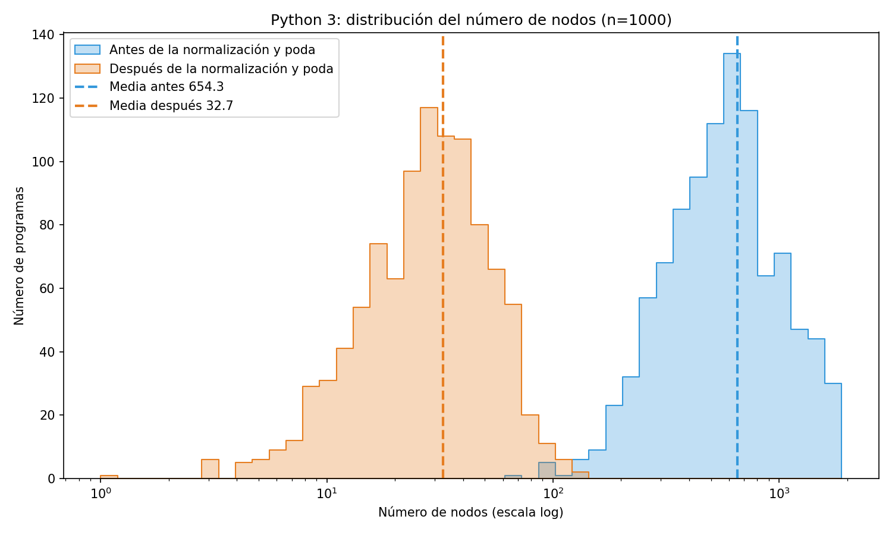
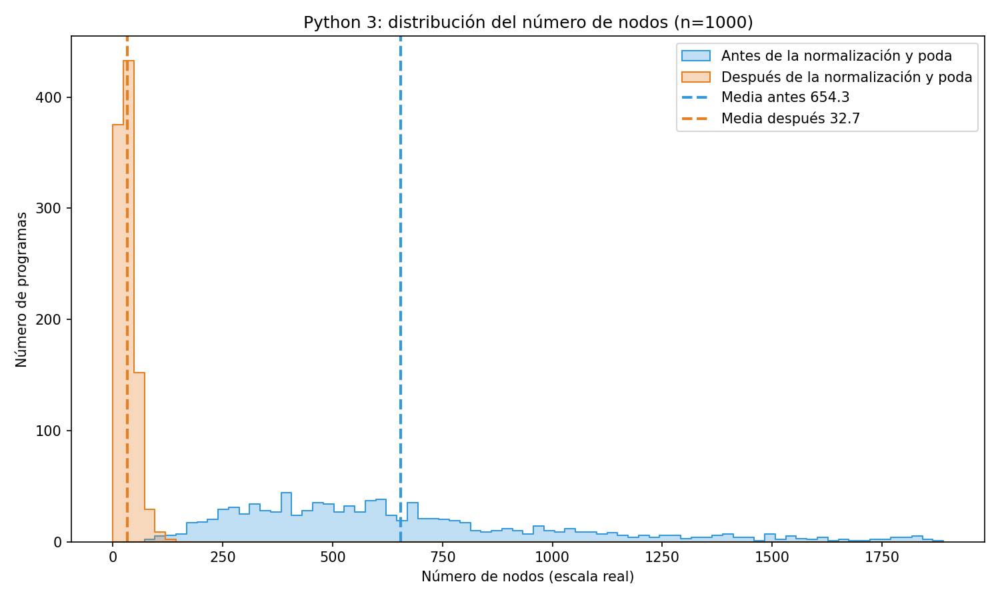
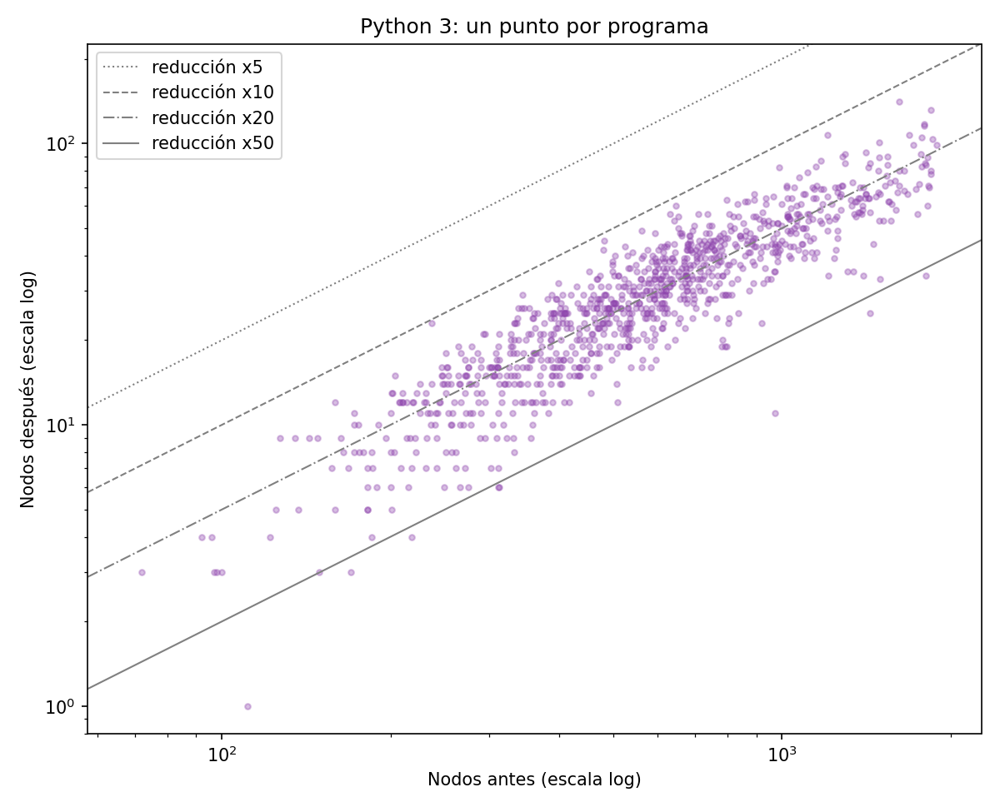
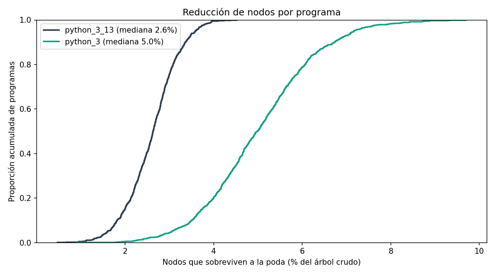

# Notebook results

Generated by `build_results.py`; do not edit by hand.

## Node reduction (Python)

Sample: **1000 programs** from `all_py` (296 problems pooled), duplicate-free (same raw ANTLR tree shape counted once), without syntax errors in either grammar, trivial programs and size outliers removed. *Before* = nodes of the raw ANTLR tree; *after* = nodes of the normalized, pruned and hashed tree given to the tree edit distance.

| Grammar | Programs | Before (mean / median / p90 / max) | After (mean / median / p90 / max) | Mean reduction | Median per-program ratio | Left with 1 node |
|---|---|---|---|---|---|---|
| `python_3_13` | 1000 | 1127 / 965 / 2067 / 3877 | 28.7 / 25 / 52 / 104 | 97.4% (x39.2) | x38.2 | 1 |
| `python_3` | 1000 | 654 / 574 / 1206 / 1890 | 32.7 / 28 / 61 / 141 | 95.0% (x20.0) | x20.2 | 1 |

Figures come from `nodes_reduction/nodes_reduction.ipynb`, one image per chart in `nodes_reduction/results/`. Per grammar: distribution on a log scale, distribution on the real node count, and a per-program scatter (before vs. after).

### `python_3_13`

### `python_3`

### Both grammars

## Homework similarity (`homeworks/main_all.ipynb`, `main_groups.ipynb`)

Dataset `INF-111-JT-Tarea 1-6876` with `python_3_13` and APTED: **56 files**, **1540 pairs**.

| Statistic | Value |
|---|---|
| Mean similarity | 0.274 |
| Median similarity | 0.23 |
| p90 / max | 0.54 / 1.00 |
| Pairs above 0.6 | 96 (6.2%) |
| Pairs above 0.8 | 10 |

Grouping at threshold 0.6 (union-find): **3 group(s)** with more than one file, 20 unique files.

| Group | Files | Average similarity |
|---|---|---|
| 1 | 2 | 0.82 |
| 2 | 17 | 0.63 |
| 3 | 17 | 0.46 |

Groups are built with union-find, so similarity can chain: a group's average (each member against its first file) may fall below the threshold.
